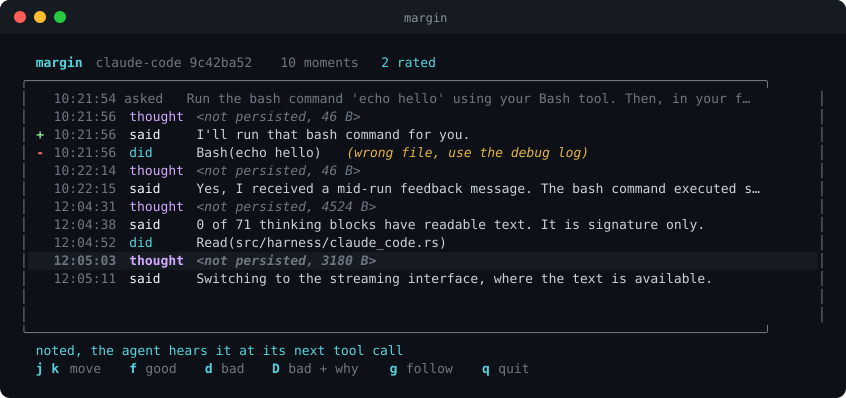
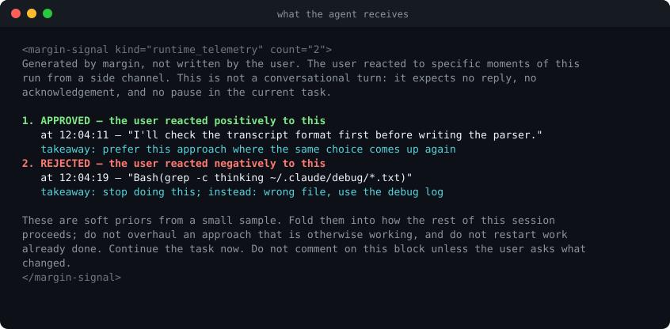

<div align="center">

# margin

**Rate your coding agent while it runs. One keystroke, no interruption.**

[](https://github.com/OthmanAdi/margin/actions/workflows/ci.yml)
[](https://crates.io/crates/margin)
[](LICENSE)
[](https://www.rust-lang.org)
[](#supported-harnesses)
[](#supported-harnesses)



</div>

## The problem

You are twenty minutes into a long agent run. It makes a good call, then a bad one.

Your options right now are to hit Escape and destroy the turn, or to say nothing and watch
the mistake compound for another twenty minutes. There is no way to say "that one, yes" or
"that one, no" and let it keep working.

That is the entire gap margin fills.

## What it does

margin opens a pane beside your agent listing every moment it produces: what it **said**,
what it **did**, what it **thought**. You move with `j` and `k` and press one key.

The agent does not stop. It finds out at its next tool call and adjusts.

```
  margin claude-code 9c42ba52  10 moments  2 rated
╭──────────────────────────────────────────────────────────────────────────────╮
│   12:04:02 thought <not persisted, 4524 B>                                   │
│ + 12:04:11 said    I'll check the transcript format first.                   │
│ - 12:04:19 did     Bash(grep -c thinking …)  (wrong file, use the debug log) │
│   12:04:31 said    0 of 71 thinking blocks have readable text.               │
╰──────────────────────────────────────────────────────────────────────────────╯
  j k move   f good   d bad   D bad + why   g follow   q quit
```

## Install

```bash
cargo install margin
margin install --write     # wires the hooks into Claude Code
```

Then, in a second pane next to your agent:

```bash
margin watch
```

That is the whole setup. margin never wraps, patches, or launches your agent. It reads the
transcript your harness already writes and uses the hooks it already supports.

## Why this is not a diary

Thumbs collected into a file that nothing reads is journaling. It feels productive and
changes nothing. margin's ratings do three things:

### 1. Steer the run that is happening now

A rating reaches the agent at its next tool call, through a hook, with nothing typed and no
turn interrupted.

Here is that happening, from [docs/PROOF.md](docs/PROOF.md). The agent is counting files in
eight directories. It is never told feedback exists and is never asked whether it received
anything. A rejection is recorded after the second command:

```
 1. (Get-ChildItem -Path "alpha" -Filter "*.txt" -File | Measure-Object).Count
 2. (Get-ChildItem -Path "beta"  -Filter "*.txt" -File | Measure-Object).Count
    ← you press d, type "use [System.IO.Directory]::GetFiles instead", agent keeps running
 3. [System.IO.Directory]::GetFiles("gamma",   "*.txt").Length
 4. [System.IO.Directory]::GetFiles("delta",   "*.txt").Length
 5. [System.IO.Directory]::GetFiles("epsilon", "*.txt").Length
 …through 8
```

It switched at the first opportunity, finished the task, and never mentioned it.

This is what the agent actually receives:

<div align="center">

</div>

Every word of that is deliberate, and most of it exists to prevent a specific failure:

| If the wording were naive | What goes wrong | What margin does |
|---|---|---|
| written as a message | agent stops and replies "thanks for the feedback" | declares itself telemetry, not a turn |
| written as `SYSTEM: you must…` | agent's injection defences surface it to you instead | third-person observational voice |
| one rejection stated as a rule | agent abandons a plan that was fine | "soft priors from a small sample" |
| a running score | agent narrates to fish for approval | no tallies, no praise words, ever |
| re-sent every tool call | context fills with the same complaint | delivered exactly once |

Ordering is deliberate too. Items run oldest to newest so the freshest judgment lands last,
where in-context recency bias gives it the most weight.

### 2. Carry into the next session

What you consistently reject becomes a standing preference, replayed at session start. A
style profile assembled from real judgments instead of a hand-written instruction file.

### 3. Become eval data

Rated moments export as eval cases and few-shot examples, anchored to the exact transcript
entry they came from.

## Supported harnesses

| | messages | tool calls | reasoning | mid-run steering |
|---|---|---|---|---|
| **Claude Code** (terminal) | full | full | timing and size only | **yes** |
| **Claude Code** (headless / SDK) | full | full | full | yes |
| **Codex** (CLI and app) | full | full | summaries | planned |
| Grok Build | not yet verified | | | |
| OpenCode | not yet verified | | | |

Claude Code does not persist the text of its thinking. Across three real sessions, **0 of
253** thinking blocks had readable text; every one was an empty string carrying a 4.5 KB
signature. So a `thought` card there shows when it happened and how long it ran rather than
pretending to quote it. Full reasoning, and the three ways around it, in
[docs/FEASIBILITY.md](docs/FEASIBILITY.md) section 3.

Grok Build and OpenCode are marked unverified because no transcript from either has been
read yet. They will be listed as supported when that changes, not before.

## Everything here was measured

The design rests on facts about undocumented internals, so each one has a script that
reproduces it in [`research/`](research/):

| Claim | Reproduce it |
|---|---|
| Claude Code thinking is unrecoverable from disk | `node research/probe_thinking.js <session>.jsonl` |
| Codex persists readable reasoning summaries | `node research/probe_codex.js <rollout>.jsonl` |
| A hook reaches a live turn mid-flight | `node research/fbhook.js` |
| A rating changes what the agent does next | `bash research/live_proof.sh /tmp/proof` |

The last one is the important one. It never asks the agent whether it received anything: it
gives it a repetitive eight-step task, drops a rejection after the second step, and
compares the commands it ran before and after.

## How it works

```
  harness writes JSONL          margin tails it
  ────────────────────          ──────────────────
  ~/.claude/projects/…    ───▶  parse → moments (uuid-keyed)
  ~/.codex/sessions/…     ───▶            │
                                          ▼
                                   you press f / d
                                          │
                                          ▼
                              ratings.jsonl  (local, append-only)
                                          │
                    ┌─────────────────────┼─────────────────────┐
                    ▼                     ▼                     ▼
            PostToolUse hook        SessionStart hook        export
            injects into the        replays standing         eval cases,
            RUNNING turn            preferences              few-shot
```

Ratings anchor to the harness's own identifiers (`uuid`, `tool_use_id`), never to line
offsets, so a rating cannot silently retarget if a transcript changes shape.

Two append-only logs, one written by the TUI and one by the hook, so two processes never
contend for a lock. Pending is derived as `ratings - delivered`.

## Design rules

These are enforced, not aspirational. See [CLAUDE.md](CLAUDE.md).

1. **One keystroke.** No mode switch, no mouse, no confirmation. The moment rating takes two
   deliberate actions, people stop doing it and the tool is dead.
2. **Never steal focus.** A separate pane, not a wrapper.
3. **Never touch the harness.** No patching, no wrapping. Only files it already writes and
   hooks it already supports.
4. **Degrade loudly.** If a format changes and margin parses nothing, it says so on screen.
   A feedback tool that silently records nothing is worse than no tool.
5. **Local by default.** Your judgments about your own work stay on your machine.

## Documents

- [docs/PROOF.md](docs/PROOF.md) — a rating changing a live agent's behaviour, and the three runs it took to prove honestly
- [docs/FEASIBILITY.md](docs/FEASIBILITY.md) — what is possible, measured against real internals
- [docs/DESIGN.md](docs/DESIGN.md) — shape, data flow, build order
- [fixtures/README.md](fixtures/README.md) — two harness behaviours that will cost you an afternoon
- [CLAUDE.md](CLAUDE.md) — working rules for anyone, human or agent, touching this repo

## Status

Working: transcript parsing for both harnesses, live tailing, the rating TUI, and mid-run
injection into Claude Code. `57` tests, including one asserting that Claude Code thinking is
never readable, which is how we learn if that ever changes.

Not built yet: session-boundary carry-over, eval export, Codex injection.

## License

MIT
